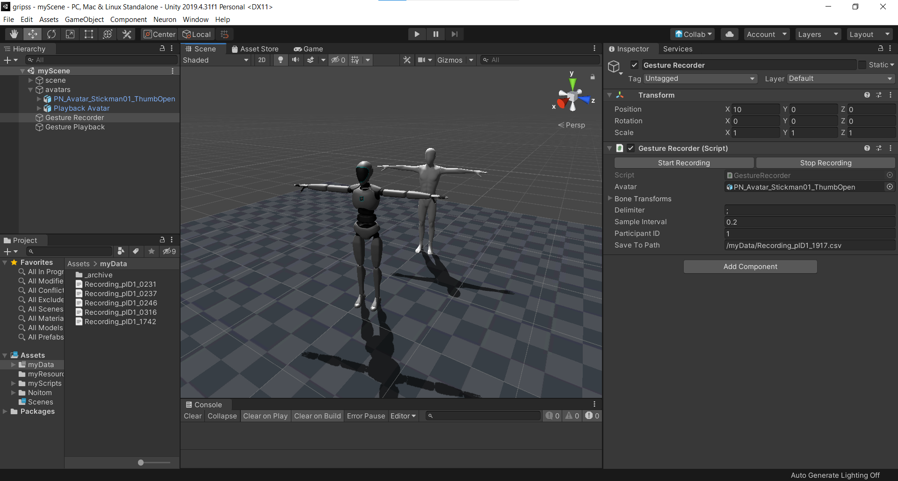
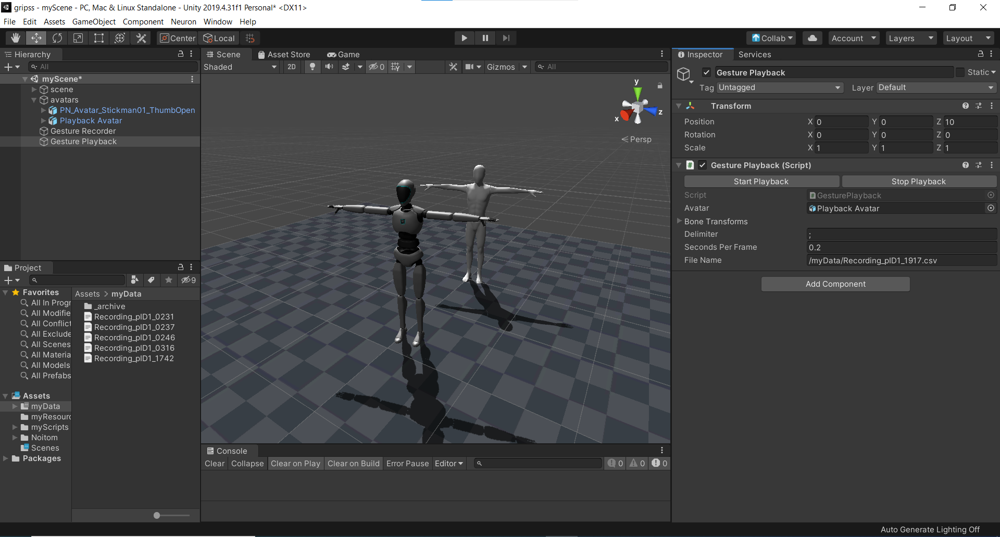

# gripss-study

## ABOUT

User study helper for the GrIPSs project.

Apparatus: [Noitom Perception Neuron](https://neuronmocap.com/?gclid=Cj0KCQiAuP-OBhDqARIsAD4XHpdZhgwlCYbRH8lmk6-ZTUZm2JQNz84YDvjYt19Y4ML4wbMAeKIeygAaArw8EALw_wcB) MoCap suit.

- Records a squence of a user's body gesture into file. 
- Also allows the experiementer to playback the recorded data.

## QUICK START

### Record a Gesture

0. Assist the participant in wearing the suit. 
1. Open your scene.
2. Select "_Gesture Recorder_" in __Hierarchy__.
3. In _Gesture Recorder_'s __Inspector__, specify:
- the avatar prefab you are going to record the gesture of. That means this avatar should be connected to Axis Neuron.
- sample interval. Defaulted to 0.2s.
- participant ID.
- (Optional) path to the file which the data will be written into. Default naming adds participant ID and current timestamp (HHmm) to avoid overwriting.
4. Hit Play to start the application.
5. When ready to perform gesture, click _Start Recording_ in __Inspector__.
6. When the gesture is finished, click _Stop Recording_ in __Inspector__.
7. The data are saved under the specified path.

### Playback a Gesture

1. Open your scene.
2. Select "_Gesture Playback_" in __Hierarchy__.
3. In _Gesture Playback's __Inspector__, specify:
- the avatar you are going to apply the playback to. This avatart should NOT be connected to Axis Neuron.
- seconds per frame, which should be the same as the sample interval you recorded the gestures with.
- path to the data file containing the gesture sequence you want to playback.
4. Hit Play to start the application.
5. Click _Start Playback in __Inspector__.
6. The gesture will play back until the end of frame. You can also terminate it by clicking _Stop Playback in __Inspector__.

